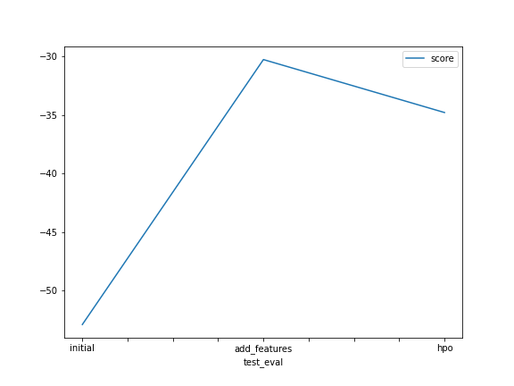
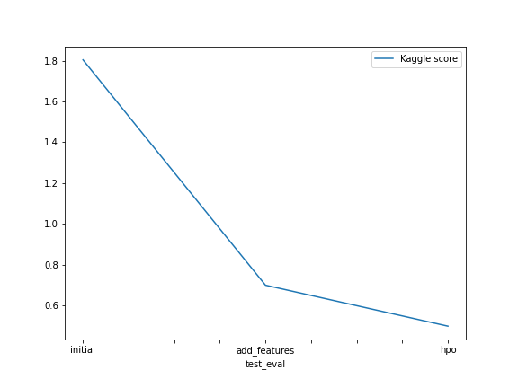

# Report: Predict Bike Sharing Demand with AutoGluon Solution
#### Ali Afsharian

## Initial Training
### What did you realize when you tried to submit your predictions? What changes were needed to the output of the predictor to submit your results?
To ensure the successful submission of our prediction, we conducted a thorough assessment to verify the absence of any negative values in our predictions.

### What was the top ranked model that performed?
The top ranked model was WeightedEnsemble_L3 with validation score of -52.911.

## Exploratory data analysis and feature creation
### What did the exploratory analysis find and how did you add additional features?
During the exploratory data analysis, several observations were made regarding the dataset. We discovered that the dataframe comprises various types of data, including datetime, numerical, and categorical variables (encoded as numbers). Additionally, two features, namely "casual" and "registered," were found to be absent in the test set. Consequently, these features were excluded from the training process.

To gain a better understanding of the data distribution, histograms were plotted for all features. We observe that certain features such as temperature exhibited a close approximation to a normal distribution. However, features like wind speed or humidity displayed skewed distributions, either to the right or left.

Furthermore, it was identified that valuable insights could be derived from the datetime column by extracting additional features, such as hour, day, and month. This allows us the exploration of new patterns in bike demand with respect to these newly created features.

### How much better did your model preform after adding additional features and why do you think that is?
After incorporating additional features, the performance of our model significantly improved. The validation score increased from -52.91 to -30.25, indicating a substantial enhancement in the model's predictive capabilities. This improvement can be attributed to the inclusion of new features, such as the month, day, and hour. These additional features provides valuable temporal information to the model. It allows the model to capture seasonality and time-of-day effects on the bike sharing demand, and ultimately leading to more precise predictions.

## Hyper parameter tuning
### How much better did your model preform after trying different hyper parameters?
In order to enhance the performance of the model, I conducted a thorough exploration of various hyperparameters. By tuning these parameters, I aimed to optimize the model's predictive capabilities. Specifically, I focused on the number of boost rounds and learning rate for the GBM model, as well as the number of estimators and maximum depth for the Random Forest model.

After experimenting with different hyperparameters, the resulting validation score showed a slight deterioration, increasing to 34.78 from the previous score of 30.25. However, this change in the validation score needs to be considered in the context of the significant improvements observed in other aspects.

One notable improvement was the remarkable reduction in prediction time, which decreased from 17.50 to 1.94. This reduction signifies a substantial enhancement in the model's efficiency, as it can now generate predictions in a fraction of the time compared to the previous configuration. Additionally, the fitting time, or the time required for the model to train on the data, decreased from 526.87 to 402.78, further contributing to improved overall efficiency and better Kaggle score. 

### If you were given more time with this dataset, where do you think you would spend more time?
I would dedicate more time to exploring and engineering additional relevant features. By analyzing the data more deeply, I may discover hidden patterns or relationships that can be leveraged to create new informative features.I would spend time experimenting with different models and algorithms to identify the best approach for this particular dataset. This would involve exploring a wider range of models, such as ensemble methods, support vector machines, or neural networks, and comparing their performance. In addition, to further optimize model performance, I would invest additional time in fine-tuning the hyperparameters. This would involve conducting more systematic searches and using techniques like grid search, random search, or Bayesian optimization to identify the most optimal combination of hyperparameters for each model.

### Create a table with the models you ran, the hyperparameters modified, and the kaggle score.
|model|Eval Metric|hpo|GBM|RF|score|
|--|--|--|--|--|
|initial|root_mean_squared_error|default|default|default|1.80495|
|add_features|root_mean_squared_error|default|default|default|0.69850|
|hpo|root_mean_squared_error|default|'GBM': {'num_boost_round': 100, 'learning_rate': 0.1}|'RF': {'n_estimators': 100, 'max_depth': 5}|0.49727|

### Create a line plot showing the top model score for the three (or more) training runs during the project.

### Create a line plot showing the top kaggle score for the three (or more) prediction submissions during the project.

## Summary
This report outlines the process and results of predicting bike sharing demand using AutoGluon. It highlights the improvements achieved by adding new features and conducting hyperparameter tuning. Hyperparameter tuning was conducted, resulting in a slight decrease in the validation score to -34.78. However, significant improvements were observed in prediction and fitting times. Given more time with the dataset, future focus areas would include further feature engineering, exploring different models and algorithms, and fine-tuning hyperparameters to optimize model performance. The final model scored 0.49727 in Kaggle leaderboard.